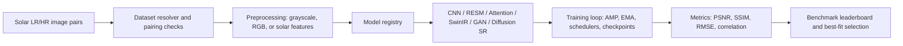

# HelioResolve

[](https://github.com/LegendOP1098/HelioResolve/actions/workflows/ci.yml)

**HelioResolve** is a solar magnetogram super-resolution project built to recover fine solar structure from low-resolution observations. It is packaged as a reusable PyTorch training suite with installable command-line tools, a model registry, reproducible benchmark workflows, and public-safe repository hygiene.

The public repository is source-first by design: private datasets, notebooks, checkpoints, trained weights, logs, and local experiment outputs are excluded.

## Recruiter Snapshot

- **Problem:** Improve low-resolution solar imagery while preserving high-frequency structure.
- **Approach:** Compare CNN, attention, transformer, GAN, and diffusion super-resolution families under one dataset and evaluation pipeline.
- **Engineering:** Modular package, CLI workflows, CI, tests, artifact hygiene, GPU diagnostics, and reusable training abstractions.
- **Models:** SRCNN, RLFB+ESA, RESM, EDSR, RCAN, SwinIR, SRGAN, ESRGAN, and conditional Diffusion SR.
- **Read first:** [docs/INTERVIEWER_BRIEF.md](docs/INTERVIEWER_BRIEF.md), [SR_PIPELINE.md](SR_PIPELINE.md), and [solarres_sr/training.py](solarres_sr/training.py).

## Highlights

- Unified LR/HR solar dataset pipeline with filename-safe pairing.
- Registry-driven model selection across CNN, attention, GAN, transformer, and diffusion families.
- Validation checkpointing, EMA evaluation, learning-rate scheduling, gradient clipping, and early stopping.
- Benchmark and fine-tuning workflows that rank models by PSNR, SSIM, bicubic gap, or a composite score.
- Public-safe repo hygiene with CI checks and lightweight smoke tests.

## System Design



## Install

```bash
python -m venv .venv
.venv\Scripts\activate
python -m pip install --upgrade pip
python -m pip install -e ".[dev]"
```

On Linux/macOS, replace the activation command with `source .venv/bin/activate`.

## Quick Start

Train a single model:

```bash
helio-train --model diffusion_sr --epochs 50 --batch-size 4
```

Benchmark strong candidates:

```bash
helio-benchmark --models resm diffusion_sr rcan edsr --epochs 40 --batch-size 4
```

Run a deliberate CPU smoke test:

```bash
helio-train --model srcnn --epochs 1 --batch-size 1 --allow-cpu-fallback --max-train-batches 2 --max-val-batches 2
```

The original script entry points are also available:

```bash
python train_sr.py --model diffusion_sr --epochs 50 --batch-size 4
python benchmark_sr_models.py --models diffusion_sr rcan edsr --epochs 40 --batch-size 4
python finetune_sr_models.py --quick-only --quick-epochs 8
```

## Dataset

Keep the dataset outside Git. The default resolver looks for this structure under the project root:

```text
Solar Dataset/
  Solar Dataset/
    training/
      low_res/
      high_res/
    validation/
      low_res/
      high_res/
```

The split names `train`/`val` and `training`/`validation` are both supported. You can pass either the project root or the actual dataset root to `--dataset-root`.

More details: [docs/DATA.md](docs/DATA.md).

## Repository Layout

```text
solarres_sr/              Core Python package
solarres_sr/models/       Model implementations and shared blocks
tests/                    Fast public-safe smoke tests
docs/                     Dataset, operations, and hygiene notes
SR_PIPELINE.md            Short model-comparison workflow summary
swinir_model.py           Standalone/reference SwinIR implementation
train_sr.py               Single-model training CLI
benchmark_sr_models.py    Multi-model benchmark CLI
finetune_sr_models.py     Search and fine-tuning CLI
train_psnr_max.py         Long-running PSNR-focused training workflow
```

## What To Review In An Interview

- `solarres_sr/registry.py`: model catalog, capacity presets, and build dispatch.
- `solarres_sr/training.py`: shared training loop, validation, checkpointing, metrics, and benchmark orchestration.
- `solarres_sr/data.py`: dataset discovery, LR/HR filename pairing, leakage checks, and solar preprocessing.
- `solarres_sr/models/resm.py`: custom Residual Edge-aware Solar Module architecture.
- `solarres_sr/models/swinir.py`: transformer-based SwinIR implementation inside the package.
- `swinir_model.py`: standalone/reference SwinIR code retained for review and comparison.

## Commands

```bash
helio-train --help
helio-benchmark --help
helio-finetune --help
helio-psnr-max --help
helio-diagnose-gpu
```

## Artifacts

Training writes run artifacts under `checkpoints/` by default, or under `--save-root` when provided. These artifacts are intentionally ignored by Git:

- `config.json`
- `history.json`
- `summary.json`
- `best_model.pt`

## Development

```bash
python -m pytest
python -m py_compile train_sr.py benchmark_sr_models.py finetune_sr_models.py train_psnr_max.py diagnose_gpu.py
```

## Privacy And Publishing

Do not commit private datasets, notebooks with rendered outputs, trained weights, checkpoints, logs, `.env` files, API keys, or cloud credentials. See `docs/REPOSITORY_HYGIENE.md` for the repo hygiene checklist.
