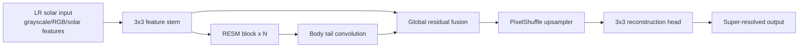

# RESM Architecture

**RESM** stands for **Residual Edge-aware Solar Module Network**. It is a compact solar-specific super-resolution architecture added to HelioResolve for interviews, experimentation, and future ablation studies.

## Why RESM

Solar magnetograms contain thin, high-frequency structures that can be blurred by generic SR models. RESM is designed to make that design goal explicit:

- residual feature extraction for stable optimization,
- channel attention for feature reweighting,
- learned edge-aware gating for high-frequency solar detail,
- pixel-shuffle upsampling for efficient reconstruction.

## Architecture



## RESM Block


## Usage

```bash
helio-train --model resm --input-mode solar_features --capacity base --epochs 50
helio-benchmark --models resm swinir rcan edsr --epochs 40
```

The model is registered in `solarres_sr/registry.py` and implemented in `solarres_sr/models/resm.py`.
